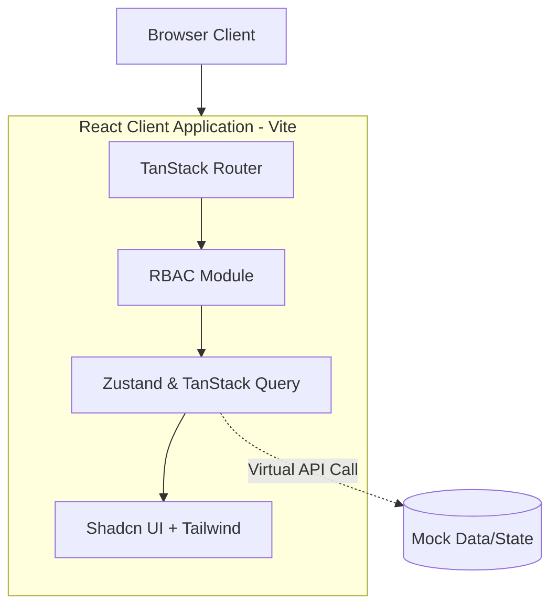
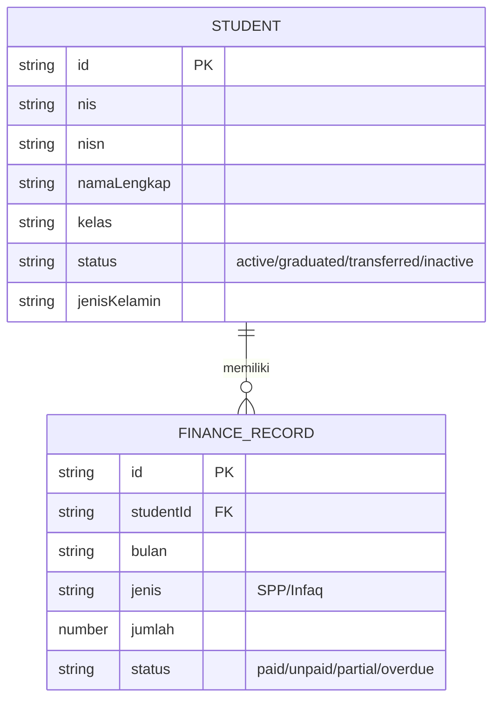
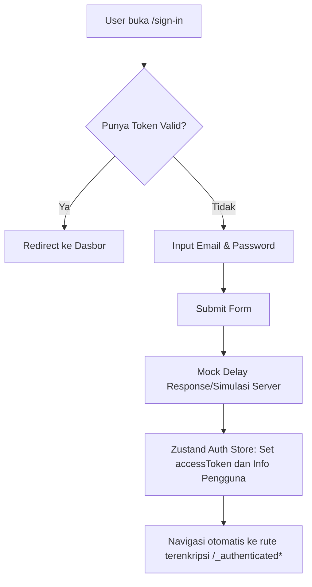

# EDARA (أدارة) — Dokumentasi Teknis Komprehensif

**Versi Dokumentasi:** 2.2.2
**Tanggal Dibuat:** 19 Maret 2026
**Dibuat Oleh:** Antigravity AI — Automated Analysis
**Status:** Draft

---

## DAFTAR ISI

1. [Ringkasan Eksekutif](#1-ringkasan-eksekutif)
2. [Arsitektur Sistem](#2-arsitektur-sistem)
3. [Struktur Proyek](#3-struktur-proyek)
4. [Model Data & Skema Database](#4-model-data--skema-database)
5. [Alur Logika & Proses Bisnis](#5-alur-logika--proses-bisnis)
6. [API & Antarmuka Program](#6-api--antarmuka-program)
7. [Panduan UI/UX](#7-panduan-uiux)
8. [Audit Keamanan](#8-audit-keamanan)
9. [Bug & Issue Tracker](#9-bug--issue-tracker)
10. [Panduan Pengembangan (Developer Guide)](#10-panduan-pengembangan-developer-guide)
11. [Testing](#11-testing)
12. [Deployment & Infrastruktur](#12-deployment--infrastruktur)
13. [Atribusi & Lisensi](#13-atribusi--lisensi)
14. [Glosarium](#14-glosarium)
16. [Standar Data Table](#16-standar-data-table)
15. [Riwayat Perubahan Dokumentasi](#15-riwayat-perubahan-dokumentasi)

---

## 1. RINGKASAN EKSEKUTIF

### 1.1 Gambaran Umum Proyek
EDARA (أدارة), yang berarti "Manajemen" dalam bahasa Arab, adalah sebuah aplikasi manajemen administrasi dan operasional sekolah. Aplikasi ini dirancang untuk memudahkan tenaga pendidik dan staf administrasi (seperti Tata Usaha, Keuangan, dan Kepala Sekolah) dalam mengelola berbagai data sekolah seperti data siswa, akademik, kepegawaian (guru/staff), dan keuangan (SPP). Aplikasi ini memiliki arsitektur Client-Side Rendering (SPA) yang dibangun dengan ekosistem modern berbasis React dan Vite. Fokus utama antarmukanya berpusat pada framework UI yang konsisten (Tailwind CSS dan Shadcn UI).

### 1.2 Status Proyek Saat Ini
Berdasarkan pengecekan kode aktual, aplikasi masih dalam tahap pengembangan aktif namun beberapa fitur besar sudah ada setidaknya sebagai *mockup* fungsional di klien (menggunakan mock data store dengan React Query/Zustand), antara lain:
- Autentikasi pengguna (melalui fitur Clerk/Auth mock).
- Role-Based Access Control (RBAC) (Admin, Kepala Sekolah, Tata Usaha, Bendahara).
- Dasbor ringkasan dengan grafik (Analytics).
- Pengelolaan Manajemen Siswa (dengan fitur Add, Edit, Delete, Import, Export data).
- Modul Keuangan / SPP (pembayaran SPP).
- Modul kelas, tahun ajaran, dan pendaftaran (PPDB).
Integrasi penuh dengan backend API tampaknya masih belum sepenuhnya disambungkan (teramati data statis `students.ts` dan logic API yang mengembalikan delay palsu `sleep()`). 

### 1.3 Ringkasan Temuan Kritis
- **Keamanan (Authentication/Authorization)**: Sistem RBAC sudah didefinisikan secara statis di `src/config/rbac.ts`, tetapi implementasi autentikasi (`user-auth-form.tsx`) mem-bypass autentikasi aktual (menggunakan mock expiration dan `setTimeout`) yang menyimpan mock info admin lokal tanpa server validation yang kuat.
- **Inkonsistensi State/API**: Banyak modul yang mengandalkan fungsionalitas pura-pura (`sleep` function) tanpa error handling / query fetch nyata kepada backend eksternal, meski ada setup `QueryClient` dan intersepsi `AxiosError`.
- **UI/UX**: Komponen UI tersusun dengan sangat baik melalui sentralisasi shadcn UI. Namun, komponen yang padat datanya seperti *DataSiswa* melakukan lazy rendering klien dari file statis besar, berpotensi memberikan masalah kinerja jika nanti dialih formatkan ke fetching asinkron penuh tanpa paginasi server.

---

## 2. ARSITEKTUR SISTEM

### 2.1 Diagram Arsitektur


*Catatan: Sistem belum terhubung eksplisit dengan API Backend / Server Production seutuhnya, tapi telah dikonfigurasi untuk siap menerimanya.*

### 2.2 Stack Teknologi

| Kategori | Teknologi | Versi | Keterangan |
|---|---|---|---|
| Core Framework | React | ^19.2.3 | View layer |
| Build Tool | Vite | ^7.3.0 | Module bundler & dev server (dengan SWC) |
| Routing | TanStack Router | ^1.141.2 | Type-safe file-based routing |
| State Management | Zustand | ^5.0.9 | Client state management |
| Data Fetching | TanStack Query | ^5.90.12 | Async server state management (cache, retry) |
| Styling | Tailwind CSS | ^4.1.18 | Utility-first CSS & theming variable |
| Component UI | Radix UI + Shadcn | - | UI headless dan komponen re-usable |
| Form Validation | React Hook Form & Zod| ^7 / ^4.2 | Validasi layer klien (schema based) |
| Icons | Lucide React | ^0.561.0 | Ikonografi SVG konsisten |
| Auth (Planned) | Clerk | ^5.58.1 | Layanan Identitas dan Manajemen Pengguna |
| Charts / Graph | Recharts | ^2.15.4 | Grafik dinamis Dasbor |
| Package Manager| pnpm | - | Menggunakan pnpm workspace (`pnpm-lock.yaml`) |

### 2.3 Pola Arsitektur
Arsitektur yang digunakan adalah **Single Page Application (SPA)** dengan pendekatan struktur **Feature-Based / Domain-Driven Folder Layout**. Daripada mengelompokkan kode berdasarkan tipe file (semua komponen di satu folder, semua fungsi di tempat lain), fitur-fitur dipisahkan seperti `src/features/siswa`, `src/features/dashboard`, `src/features/auth`, dimana dalam 1 folder feature ini terdapat file `index.tsx`, `components/`, dan `data/` yang dikhususkan hanya untuk *domain* tersebut. Ini sangat baik untuk skalabilitas.

### 2.4 Dependency Antar Modul
- Modul-modul feature (seperti `siswa`, `dashboard`) selalu mengkonsumsi modul `components` (khususnya folder `components/ui`) untuk tampilan standar.
- Pengaturan identitas dikendalikan penuh oleh modul `stores` (misal, `auth-store.ts`) yang selanjutnya menentukan render komponen dan navigasi lewat TanStack Router di dalam root.

---

## 3. STRUKTUR PROYEK

### 3.1 Pohon Direktori Lengkap

```text
src/
├── assets/             # Berkas gambar ikon kustom (brand-icons)
├── components/         # Komponen UI global re-usable (Shadcn + custom layout)
├── config/             # Konstanta dan konfigurasi global (fonts, rbac)
├── context/            # React Context global (tema, font, RTL/LTR)
├── features/           # Modul fitur berbasis domain bisnis
│   ├── auth/           # Login, Registrasi, Forgot Password, OTP
│   ├── dashboard/      # Ringkasan analitik dan grafik
│   ├── siswa/          # Manajemen data siswa
│   ├── kelas/          # Manajemen rombongan belajar
│   ├── keuangan/       # Laporan keuangan
│   ├── spp/            # Komponen pembayaran SPP
│   └── (fitur lain)    # ... (guru, ppdb, settings, users, dll)
├── hooks/              # Custom React hooks (contoh: use-tenant)
├── lib/                # Fungsi utilitas murni (cn, formatting rupiah, error handle)
├── routes/             # File-file rute TanStack Router
├── stores/             # Global Store Zustand (auth-store, tenant-store)
├── styles/             # Berkas CSS root (Tailwind config + theme tokens)
├── main.tsx            # Entry point utama aplikasi klien
└── routeTree.gen.ts    # File yang dibuat otomatis (auto-generated) oleh TanStack Router
```

### 3.2 Konvensi Penamaan
- **Nama File / Direktori**: Menggunakan `kebab-case` (misal: `config-drawer.tsx`, `auth-store.ts`).
- **Nama Komponen/Fungsi**: Menggunakan `PascalCase` untuk komponen React (misal `SiswaAddDialog`) dan `camelCase` untuk fungsi utilitas / hooks (`handleServerError`, `useAuthStore`).
- **Konstanta**: Menggunakan `UPPER_SNAKE_CASE` atau `camelCase` lokal di module.

### 3.3 Penjelasan Setiap Modul/Package Utama

#### 3.3.1 Modul Fitur Siswa
- **Lokasi:** `src/features/siswa`
- **Tanggung Jawab:** Mengelola data diri, akademik, keuangan, dan rekam jejak setiap siswa. Terdapat operasi CRUD mock menggunakan tabel, form berbasis Zod, dan dialog interaktif (Add/Edit).
- **File Kunci:** `index.tsx`, `data/schema.ts`, `components/siswa-add-dialog.tsx`, `components/siswa-table.tsx`
- **Diekspor:** Komponen utama halaman `DataSiswa`

#### 3.3.2 Modul Autentikasi
- **Lokasi:** `src/features/auth`
- **Tanggung Jawab:** Halaman masuk sistem untuk user. (Dalam iterasi ini menggunakan statis mockup di `user-auth-form.tsx`).
- **File Kunci:** `sign-in/index.tsx`, `sign-in/components/user-auth-form.tsx`

---

## 4. MODEL DATA & SKEMA DATABASE

### 4.1 Entity Relationship Diagram
(Berdasarkan penemuan Zod skema entitas di klien)



### 4.2 Deskripsi Entitas

#### 4.2.1 Student (Siswa)
Berdasarkan `src/features/siswa/data/schema.ts`:
| Field | Tipe | Wajib | Deskripsi | Validasi |
|---|---|---|---|---|
| id | string | Ya | UUID Pembeda unik | |
| nis | string | Ya | Nomor Induk Siswa | |
| nisn | string | Ya | Nomor Induk Siswa Nasional | |
| namaLengkap | string | Ya | Nama terang dari pendaftar | |
| jenisKelamin | enum | Ya | Gender kandidat ("L" atau "P") | Enum Constraint |
| status | enum | Ya | "active", "graduated", "transferred", "inactive" | Enum Constraint |
| kelas | string | Ya | Info kelas penempatan | |
| (data ortu) | - | - | Nama ibu/ayah, NIK, pekerjaan wali | |

### 4.3 Relasi Antar Entitas
Logika bisnis mengandalkan kaitan antara `Student` (detail siswa) dengan modul entitas pendampingnya misal `StudentFinanceRecord` yang mengindikasikan beban pembayaran per bulan bagi seorang Siswa. Relasi ini dipatuhi di klien melalui penyaringan data berdasarkan properti `studentId`.

### 4.4 Strategi Migrasi Database
Karena aplikasi ini fokus di SPA klien dan saat ini menggunakan *mock file arrays* dan *zod schemas* klien murni (contoh: `students.ts`), tak terdapat sistem migrasi seperti Prisma atau TypeORM. Database migrasi menjadi domain dari Server/Backend (yang tidak berada di repositori ini).

---

## 5. ALUR LOGIKA & PROSES BISNIS

### 5.1 Daftar Fitur & Modul Fungsional
1. Dasbor Analitik (Grafik Pendapatan SPP & Kehadiran/Stat Siswa).
2. Manajemen Siswa & Kelas.
3. Kontrol Akses Basis Peran (RBAC - Role Based Access Control).
4. Administrasi Keuangan & SPP.

### 5.2 Alur Proses Tiap Fitur Utama

#### 5.2.1 Autentikasi dan Otorisasi (Login)
**Deskripsi:** Proses masuk user menuju rute yang dilindungi.
**Alur Proses:**

**File Terkait:**
- `src/features/auth/sign-in/components/user-auth-form.tsx` — Validasi dan submit logic.
- `src/stores/auth-store.ts` — Penyimpanan cookie kredensial status masuk.
- `src/config/rbac.ts` — Matrix perizinan matriks peran pengguna ke menu.

---

## 6. API & ANTARMUKA PROGRAM

### 6.1 Daftar Endpoint / API Routes
Skenario saat ini **belum tersambung dengan API Backend langsung**; sistem mensimulasikan server menggunakan mock data (array di `data.ts`) dan menirukan jeda *latency* menggunakan fungsi perantara `sleep()`. Aplikasi sudah bersiap memanggil API dengan infrastruktur Axios dan interceptor (di `main.tsx`) dan React Query.

### 6.2 Format Request & Response Interceptors
Dari `src/main.tsx` dan `src/lib/handle-server-error.ts`:
Interseptor secara default siap merespon kembalian (Axios Error) 401 dan 403:
- Jika mendapat API HTTP 401 Unauthorized, Zustand store dikosongkan (`useAuthStore.getState().auth.reset()`) dan client diredirect paksa ke halaman `/sign-in`.
- Jika mendapat HTTP 500, notifikasi toast muncul dan diredirect ke rute `/500` (error murni).

---

*... Drafting bagian lain ...*


## 7. PANDUAN UI/UX

### 7.1 Design System

Sistem desain diimplementasikan melalui **Tailwind CSS V4** terpusat dalam berkas `src/styles/theme.css` dan `index.css`.

#### 7.1.1 Palet Warna CSS Variables (Tema Gelap dan Terang)
Proyek ini mengadopsi standar palet warna HSL berbasis variabel custom.
Beberapa token kunci:
- `--background`: (0 0% 100%) terang, (var(--sidebar-background)) untuk gelap.
- `--primary`: warna utama brand.
- `--destructive`: warna pesan bahaya/hapus (biasanya merah ~ 0 62.8% 30.6%).
- Sistem Shadcn UI mengekstrak komponen CSS variables ini di Tailwind class lewat utilitas.

#### 7.1.2 Komponen UI (Shadcn + Radix)
Daftar inventarisasi UI komprehensif berdasar Shadcn di dalam `src/components/ui/`:
- `card` & `stat-card`: Reusable info box berbayang
- `dialog` & `alert-dialog`: Modal konfirmasi aksi
- `form`, `input`, `select`, `checkbox`, `switch`: Modul input data (terhubung React Hook Form)
- `tabs`: Navigasi halaman minor tanpa root pindah

### 7.2 Halaman / Screen
Semua layar modular didefinisikan secara TanStack routing *File-based* di dalam `src/routes/`.
- Rute `/__root.tsx` memuat layout root (dengan layout Toaster, Devtools navigation progress).
- Rute `/_authenticated/` membungkus rute yang butuh check kredensial.

---

## 8. AUDIT KEAMANAN

### 8.1 Ringkasan Temuan Keamanan
| ID | Kategori OWASP | Lokasi | Severity | Status |
|---|---|---|---|---|
| SEC-001 | A07: Auth Failures | `auth-store.ts`, `user-auth-form.tsx` | CRITICAL | Open |
| SEC-002 | A01: Broken Access | `rbac.ts` | MEDIUM | Open |

### 8.2 Detail Temuan

#### SEC-001 — Otorisasi Tiruan (Client-Side Only Authentication)
- **Kategori:** A07:2021-Identification and Authentication Failures
- **Severity:** CRITICAL
- **Lokasi:** `src/features/auth/sign-in/components/user-auth-form.tsx`, baris 57-78
- **Deskripsi:** Aplikasi mensimulasikan proses masuk secara lokal pada klien melalui pemalsuan expiration date (Date.now + 24 jam) menggunakan objek token sembarang (`'mock-access-token'`) yang dikirim ke Cookie persisten tanpa ada pengesahan API eksternal yang di-enkripsi. Password tidak diproses, langsung membolehkan masuk.
- **Dampak Potensial:** Meskipun aplikasi diklaim sedang 'tahap development preview', setiap user yang menemukan versi *live* situs tanpa backend terpakai bisa memicu login palsu untuk melihat struktur dan rute admin dashboard, membocorkan alur internal dan mock data ke publik.
- **Rekomendasi Perbaikan:** Harus dihubungkan ke penyedia IDP (Clerk sebagaimana terlihat di package JSON) atau server autentikasi custom dan menggunakan token JWT yang divalidasi dengan middleware.

---

## 9. BUG & ISSUE TRACKER

### 9.1 Ringkasan Bug yang Ditemukan
| ID | File | Baris | Jenis | Severity | Deskripsi Singkat |
|---|---|---|---|---|---|
| BUG-001 | `src/main.tsx` | 68 | Logika | INFO | Rute "Forbidden" (403) di-*comment* out. |

#### BUG-001 — Rute Forbidden Tidak Ada
- **Lokasi:** `src/main.tsx` di dalam intercept handler.
- **Jenis:** Handling Error Tidak Tuntas.
- **Severity:** LOW
- **Deskripsi:** Di respon *status HTTP 403 (Forbidden)*, handler seharusnya mendirect ke router `/forbidden`, namun baris perintah navigasinya dikomentari (`// router.navigate("/forbidden")`). Jika user memaksa manipulasi token untuk membuka modul *Siswa* melalui URL direct sementara otorisasinya tidak boleh (*misal Bendahara*), sistem tidak me-redirect ke page keterangan error (karena baris di-comment), UI hanya tak memunculkan komponen fetch. Hal ini mengurangi konsistensi User Experience.

---

## 10. PANDUAN PENGEMBANGAN (DEVELOPER GUIDE)

### 10.1 Setup Lingkungan Development
Prasyarat Lingkungan:
- Node.js versi 18 ke atas (Direkomendasikan 20+ `types/node 25.0`)
- pnpm (package manager default) `npm i -g pnpm`

Langkah Eksekusi:
```bash
# Instal dependensi
pnpm install

# Menjalankan dev server di localhost (Vite)
pnpm run dev

# Membangun produksi (TS Typecheck => Vite Build)
pnpm run build

# Menjalankan linter untuk format code standar
pnpm run lint
pnpm run format
```

### 10.2 Pola yang Harus Diikuti
Tim diinstruksikan menjaga standar TanStack Router untuk modifikasi rute. Hindari penggunaan React Router DOM. Fitur baru selayaknya mendirikan folder mandiri di dalam direktori absolut `src/features/`.
Struktur modularitas:
`src/features/<TUGAS>/components/...`
`src/features/<TUGAS>/data/...`

### 10.3 Integrasi Form & Alert
Setiap kali mengintegrasikan data isian entitas siswa, gunakan standard reaktor pengait bawaan Hook Form yakni implementasi ekosistem **Zod Schema**: `const form = useForm<z.infer<typeof entitasSchema>>({ ... })`.

---

## 11. TESTING
**Sistem ini saat ini belum memiliki folder pengujian eksplisit (unit tests `.test.ts`, `.spec.ts` maupun struktur e2e testing Cypress/Playwright).**
Diwajibkan membuat setup dasar menggunakan pilar Vitest yang satu alur/sekeluarga dengan modul builder (Vite).

---

## 12. DEPLOYMENT & INFRASTRUKTUR
Target build Vite diarahkan ke `dist/`. Dari berkas `netlify.toml` yang ditemukan terdeteksi bahwa *continuous deployment* mengarah ke layanan statis Netlify:
```toml
[build]
  command = "node --version && pnpm install && pnpm run build"
  publish = "dist"
```
Dengan catchall rewrite untuk SPA agar tak melahirkan notif 404 pada deep URL.

---

## 13. ATRIBUSI & LISENSI
File `LICENSE` menunjukkan proyek menggunakan dasar lisensi sumber standar. Dependensi yang berlisensi MIT mencakup React, Tailwind, Shadcn UI komponen, Lucide, dll.

---

## 14. GLOSARIUM
| Istilah | Definisi dalam Konteks EDARA |
|---|---|
| SPA | Singkatan Single Page Application, jenis arsitektur web dinamis. |
| SPP | Sumbangan Pembinaan Pendidikan, iuran wajib bulanan siswa. |
| RBAC | Role-based Access Control, logika hak limitasi staf berdasarkan posisinya (admin, tata usaha). |

---

## 16. STANDAR DATA TABLE
Aplikasi ini memiliki standar penggunaan Data Table berbasis `@tanstack/react-table` untuk menjaga konsistensi UI/UX di seluruh modul.

### 16.1 Komponen Inti
- **DataTableToolbar**: Komponen standar untuk kontrol di atas tabel.
    - Lokasi Kolom Pencarian: Sisi kiri (Top-Left).
    - Lokasi Filter Faceted: Sisi kiri, setelah pencarian.
    - Lokasi Toggle Kolom: Sisi kanan (Top-Right).
- **DataTablePagination**: Komponen standar untuk kontrol di bawah tabel.
    - Lokasi Row Limit: Sisi kiri (Bottom-Left).
    - Lokasi Paginasi & Info Halaman: Sisi kanan (Bottom-Right).
- **DataTableColumnHeader**: Komponen untuk header kolom yang mendukung sorting.

### 16.2 Aturan Kontainer (Card Wrapper)
Untuk menjaga kepadatan informasi dan hierarki visual, penggunaan kontainer diatur sebagai berikut:
- **Tanpa Container (Main Content)**: Digunakan jika tabel adalah konten utama dan satu-satunya fokus di halaman tersebut.
    - *Contoh: Halaman Data Siswa, Data Guru, Manajemen User.*
- **Dengan Container (Card Wrapper)**: Digunakan jika tabel adalah bagian dari komponen lain atau berada dalam layout yang lebih kompleks.
    - *Contoh: Tabel dalam Tabs (Kalender Daftar), Tabel dalam dashboard dengan statistik (Pembayaran Siswa), atau Tabel Master Data (Tahun Ajaran, Kelas).*

---

## 15. RIWAYAT PERUBAHAN DOKUMENTASI
| Versi | Tanggal | Penulis | Perubahan |
|---|---|---|---|
| 2.2.1 | 17 Maret 2026 | Claude Code | Pembuatan awal dokumen secara menyeluruh. |
| 2.2.2 | 19 Maret 2026 | Antigravity AI | Penambahan Standar Data Table dan refaktorisasi komponen SPP & Akademik. |

---

*Dokumentasi ini diperbarui secara otomatis melalui analisis kode oleh Antigravity AI.  
Untuk pertanyaan atau koreksi, hubungi tim pengembang sentral EDARA.*
